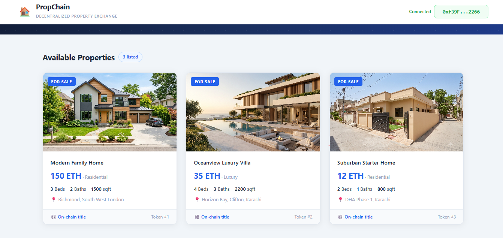

# PropChain


PropChain is a decentralized real-estate marketplace built with Solidity, Hardhat, React, and Ethers.js. It lets sellers list properties as NFTs, buyers deposit earnest money, inspectors approve inspections, lenders fund the transaction, and the sale can be finalized through an escrow contract.

## Features

- ERC-721 property NFTs
- Escrow-based property purchase flow
- Buyer, seller, inspector, and lender roles
- React frontend connected to a local Hardhat network
- Metadata stored in local public files for development

## Architecture
Three-tier architecture:
- **Frontend:** React.js + Ethers.js (wallet connection, contract interaction)
- **Smart Contracts:** Solidity — ERC-721 NFT contract + multi-party Escrow contract
- **Storage:** IPFS for decentralized property metadata

## 📸 Screenshots



## Project structure

- contracts/: Solidity smart contracts
- scripts/: deployment and setup scripts
- src/: React frontend and contract configuration
- test/: Hardhat contract tests
- public/metadata/: sample property metadata used during development

## Prerequisites

- Node.js 18 or 20
- npm
- MetaMask

## Installation

1. Clone the repository
2. Install dependencies:
   ```bash
   npm install
   ```

## Local development

### 1. Start a local Hardhat node

```bash
npx hardhat node
```

### 2. Deploy the contracts

In a second terminal:

```bash
npx hardhat run ./scripts/deploy.js --network localhost
```

### 3. Start the frontend

```bash
npm run start
```

## Environment configuration

The project uses environment variables for network configuration. Create a file named `.env` in the project root with the following values:

```env
REACT_APP_LOCALHOST_RPC=http://127.0.0.1:8545
REACT_APP_CHAIN_ID=1337
REACT_APP_METADATA_BASE_URL=http://localhost:3000/metadata
```

The frontend reads these values from [src/config.json](src/config.json), and the deployment script can now be pointed at an IPFS gateway or a hosted metadata service.

## Testing

```bash
npx hardhat test
```
## 🧠 Key Learnings

- Implementing trustless atomic swaps using the Escrow smart contract pattern
- ERC-721 token standards and storing NFT metadata on IPFS
- Writing and running Hardhat test suites for smart contract validation
- Connecting a React frontend to Ethereum via Ethers.js v6

## Notes

This project is intended for local development and learning. For production use, you should replace the local metadata storage with IPFS or decentralized storage and harden the smart contracts with additional security checks.
